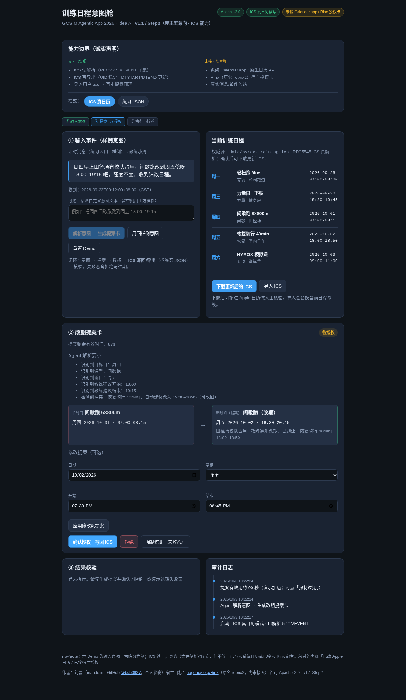
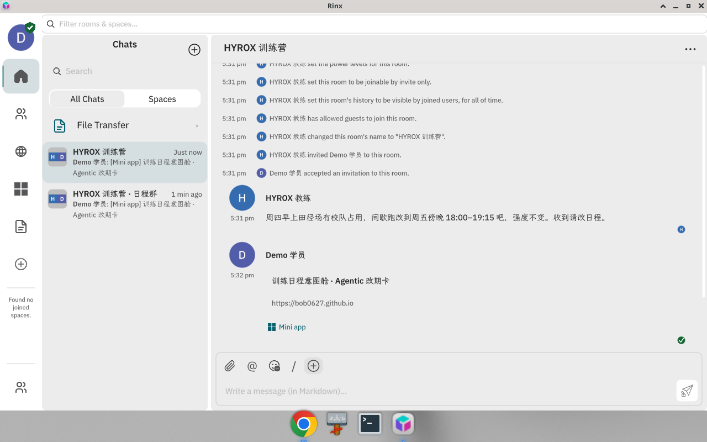

<p align="center"></p>

# 训练日程意图舱 · GOSIM Agentic App 2026

> **v1.1 / Step2（帝王蟹意向 · ICS 能力）** · OctoSense 场景 **03 日历**  
> 作者：**刘磊（mandolin）** · GitHub [@bob0627](https://github.com/bob0627) · 个人参赛  
> 许可：**Apache-2.0**（`SPDX-License-Identifier: Apache-2.0`）· Copyright 2026 刘磊 / mandolin  
> 宿主：[hagency-org/Rinx](https://github.com/hagency-org/Rinx)（**原名 robrix2**）· **已实测可在 Rinx（`f18869e`）中以网页卡片（URL 卡片）分享并打开；尚未接入 Rinx 宿主授权卡**  
> 初赛截止：2026-10-04 23:59（北京时间）· 提交材料见 [SUBMISSION.md](SUBMISSION.md)

## 一句话

教练发来一条改期消息 → Agent 读取当前训练日程、解析意图、检测冲突，生成**改期提案卡** → 用户**确认 / 修改 / 拒绝** → 确认后**写回 ICS**（UID 不变，DTSTART/DTEND 更新）→ **结果核验 + 审计日志**；拒绝、过期、写冲突都有明确失败态。

> 人物故事：一位备赛 HYROX 的业余选手（本作品不是 HYROX App，HYROX 只是日历 Demo 的人物背景）。



## 在线体验

直接打开 **[https://bob0627.github.io/gosim-intent-cabin/](https://bob0627.github.io/gosim-intent-cabin/)**（GitHub Pages 托管，免安装）。同一地址已在 Rinx 中作为网页卡片分享并打开，见 [docs/rinx-url-card.md](docs/rinx-url-card.md)。



## 快速启动

```bash
git clone https://github.com/bob0627/gosim-intent-cabin.git
cd gosim-intent-cabin
python3 -m http.server 8877
# 浏览器打开 http://127.0.0.1:8877/
# 端口被占用时换任意空闲端口即可
```

- **依赖：** 纯静态前端，无 npm、无 CDN、无后端、无外部网络请求（只读取同目录下的数据文件）。只需 Python 3（或任意静态文件服务器）+ 现代浏览器。
- 也可以直接双击 `index.html`：`file://` 下若 `fetch` 数据文件失败，脚本会改用内嵌的同内容 ICS/JSON 兜底，闭环仍可走通。

## 支持平台

| 项 | 说明 |
|---|---|
| 运行形态 | 静态网页（HTML/CSS/原生 JS）；已实测作为 Rinx 的**网页卡片（URL 卡片）**分享并打开 |
| 浏览器 | 近两年的 Chrome / Edge / Firefox / Safari（桌面与移动端）；需支持 ES2017、`localStorage`、`Blob` 下载 |
| 操作系统 | macOS / Windows / Linux / iOS / Android（浏览器内运行，不依赖操作系统 API） |
| 已实测 | Debian 13 x86_64 + Chromium 151（Playwright headless），见 `docs/screenshots/01–06`；Debian 13 x86_64 + Rinx `f18869e` 网页卡片 → Google Chrome，见 `docs/screenshots/rinx-01–04` |
| 本地服务 | Python 3.8+ `http.server`（仅用于提供静态文件） |

## 宿主版本（Rinx）

| 项 | 状态 |
|---|---|
| 宿主仓库 | [hagency-org/Rinx](https://github.com/hagency-org/Rinx)（原名 robrix2；更早的上游为 `OctoSense-org/robrix2`） |
| 实测提交 | `main` @ `f18869e4674fb8ffb666b424879ab820d114e432`（2026-10-04 14:22 北京时间，`Cargo.toml` 版本 1.1.0）；上游暂无 Release 标签。此前文档参考过 `9b5e570` |
| 宿主构建要求 | Rust 1.98.0（仓库 pin）+ CMake；macOS 产物为 `Rinx.app`，可执行文件 `rinx` |
| 本作品与宿主的关系 | **网页卡片（URL 卡片）级接入，已实测**：在 Linux 上构建运行 Rinx `f18869e`，用聊天输入栏「⊕ → Share mini app」把在线地址发成 Mini app 卡片，聊天中显示卡片、点开进入 Rinx 小程序面板，再点 **Open in browser** 打开作品页面。截图与复现步骤见 [docs/rinx-url-card.md](docs/rinx-url-card.md) |
| 未接入部分 | **未编译进 Rinx、未调用 Rinx 的授权卡 / 日历 / 消息 API**；页面拿不到聊天记录或账号；授权仍是页面内「确认 / 拒绝」。Linux 版 Rinx 不内嵌网页（需点 Open in browser）；macOS / iOS 的面板内嵌 WebKit 显示**未实测** |

详见 [env-notes.md](env-notes.md)。

## 能力边界（诚实声明）

| 层 | 真实能力（已实现） | 练习数据 / 概念演示 | 未接入（勿宣称） |
|---|---|---|---|
| 输入事件 | 可粘贴任意文本 | 教练消息是**练习样例**；解析为关键词规则 | 真实 IM / 邮件 / Matrix / Rinx 消息读入页面 |
| 读日程 | **真**：解析 `data/hyrox-training.ics`（RFC 5545 VEVENT 子集）；可导入用户自己的 `.ics` | 训练日程内容为虚构 | 系统 Calendar.app / 原生日历读取 API |
| 冲突检测 | **真**：按同日时间段重叠计算 | — | — |
| 授权 | 页内「确认 / 拒绝」+ 90 秒有效期 | 授权卡是网页内模拟 | **Rinx 宿主授权卡** |
| 写日程 | **真**：生成更新后的 `.ics` 并下载（UID 稳定、DTSTART/DTEND 更新、SUMMARY 保留） | 练习 JSON 模式写 `localStorage` | 直接改系统日历；需用户手动导入 `.ics` |
| 核验 | 结果面板 + 审计日志 + 下载文件可比对 | — | — |

**不得**据此宣称「已写入系统日历」或「已接入 Rinx 授权卡 / 宿主 API」。可以说的是：「可在 Rinx 中以网页卡片分享并打开（已实测，Linux 上经 Open in browser 打开）」。

## 演示脚本（约 3 分钟）

### 快乐路径（ICS）

1. 打开页面，确认模式为 **「ICS 真日历」**（默认）；右侧日程来自解析 `data/hyrox-training.ics`。
2. 左侧可见教练改期样例（或粘贴自定义文本）。
3. 点 **「解析意图 → 生成提案卡」**。
4. 查看旧 / 新时间对比；周五 18:00 与「恢复骑行」冲突，Agent 自动建议避让为 19:30–20:45。
5. （可选）修改日期 / 时间 → **应用修改到提案**。
6. 点 **「确认授权 · 写回 ICS」**。
7. 点 **「下载更新后的 ICS」**，用文本编辑器打开：目标事件 **UID 不变**、**DTSTART/DTEND 已改为新时间**、**SUMMARY 保留**（参考 `docs/evidence/ics-diff.txt`）。
8. （人工，可选）把 `.ics` 拖进 Apple 日历等核对显示时间。

### 导入 ICS

点 **「导入 ICS」** 选择含 `VEVENT` 的 `.ics` → 右侧日程更新为解析结果 → 再走提案 → 确认 → 下载核验。

### 失败态

| 态 | 步骤 | 预期 |
|---|---|---|
| **拒绝** | 重置 → 生成提案 → **拒绝** | 「用户拒绝授权：未修改任何日程」 |
| **过期** | 重置 → 生成提案 → **强制过期**（或等约 90 秒） | 无法再确认，日程不变 |
| **写冲突** | 生成提案 → 改为周三 18:30–19:45（与力量日重叠）→ 应用 → 确认 | 「冲突……未写入」 |

### 练习 JSON 模式

点 **「练习 JSON」** 切回 v1 行为（`data/schedule.json` + `localStorage`），便于对比 Step1。

## 仓库结构

```
gosim-intent-cabin/
├── index.html               # 单页 Demo
├── css/styles.css
├── js/calendar-ics.js       # ICS 解析 / 序列化 / 下载（无依赖）
├── js/app.js                # 解析 / 提案 / 授权 / 模式切换 / 失败态
├── data/hyrox-training.ics  # 默认日程源（RFC 5545，练习数据）
├── data/schedule.json       # Step1 练习 JSON
├── assets/icon.svg, icon-512.png
├── docs/screenshots/        # 关键流程截图（01–06）+ Rinx 网页卡片截图（rinx-01–04）
├── docs/rinx-url-card.md    # 在 Rinx 中以网页卡片打开的实测记录与复现步骤
├── tools/rinx-local-seed.py # 本地测试 Matrix 服务器建群 / 发卡片脚本（复现用）
├── docs/demo/               # 演示短视频（MP4）
├── docs/evidence/           # 写回后的 ICS、diff、审计日志、Rinx 卡片消息内容
├── docs/demo-script.md      # 60–90 秒视频分镜
├── SUBMISSION.md            # 初赛提交说明
├── AGENTS.md                # 架构与数据边界
├── env-notes.md             # Rinx（原 robrix2）宿主环境结论
├── LICENSE                  # Apache License 2.0 全文
└── NOTICE
```

## 作者与支持

- 作者：刘磊（mandolin），GitHub [@bob0627](https://github.com/bob0627)
- 支持方式：在本仓库提 [GitHub Issue](https://github.com/bob0627/gosim-intent-cabin/issues)

## 许可

```
SPDX-License-Identifier: Apache-2.0
Copyright 2026 刘磊 (mandolin)
```

本项目以 [Apache License 2.0](LICENSE) 发布。
